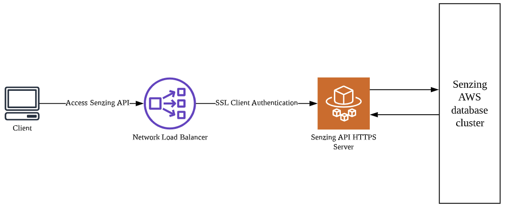

# aws-cloudformation-dev-rest

## Synopsis

Using the AWS Cloudformation template in this repository,
a developer can bring up an AWS stack to interact with Senzing's API server
in a secure manner.

## Overview

The following diagram illustrates a Senzing stack that would be brought up by the AWS CloudFormation template.

Using this stack, a developer could view the api documentation via swagger and access Senzing's api server to interact with Senzing.



## Contents

1. [Pre-requisites](#pre-requisites)
1. [Deploy](#deploy)
1. [Generate keystores for SSL client authentication](#generate-keystores-for-ssl-client-authentication)
1. [Interact with Senzing API Server using SSL client authentication](#interact-with-senzing-api-server-using-ssl-client-authentication)
1. [Example application](#example-application)
1. [References](#references)

## Pre-requisites

1. Deploy [aws-cloudformation-database-cluster cloudformation stack](https://github.com/Senzing/aws-cloudformation-database-cluster)
1. FIXME: Install `keytool`
    1. FIXME: Make it clear what needs to be installed and why a certain version is needed.
    1. FIXME: Install [adoptopenjdk 11](https://adoptopenjdk.net/archive.html)
    1. FIXME:  If the `keytool` is already installed...
1. Install [git](https://github.com/Senzing/knowledge-base/blob/master/HOWTO/install-git.md)

## Generate keystores for SSL client authentication

:thinking: **Optional:**

The following example instructions would typically be done by a **system admin**
before bringing up this cloudformation template.
If values for
`KEYTOOL_SERVER_STORE_FILE_BASE64`,
`KEYTOOL_SERVER_PASSWORD`,
`KEYTOOL_SERVER_ALIAS`,
`KEYTOOL_CLIENT_TRUST_STORE_FILE_BASE64`, and
`KEYTOOL_CLIENT_PASSWORD`
already exist, then skip forward to
[Deploy](#deploy).

To create SSL credentials:

1. :pencil2: Create values for variables.
   Example:

    ```console
    export KEYTOOL_CLIENT_ALIAS=my-senzing-client
    export KEYTOOL_CLIENT_CERTIFICATE_FILE=~/my-senzing-client.cer
    export KEYTOOL_CLIENT_PASSWORD=BadClientPassword
    export KEYTOOL_CLIENT_STORE_FILE=~/my-senzing-client-store.p12
    export KEYTOOL_CLIENT_TRUST_STORE_FILE=~/my-senzing-client-trust-store.p12
    export KEYTOOL_SERVER_ALIAS=my-senzing-server
    export KEYTOOL_SERVER_PASSWORD=BadServerPassword
    export KEYTOOL_SERVER_STORE_FILE=~/my-senzing-server-store.p12
    ```

1. Synthesize variables.
   Example:

    ```console
    export KEYTOOL_CLIENT_TRUST_STORE_FILE_BASE64=${KEYTOOL_CLIENT_TRUST_STORE_FILE}.base64
    export KEYTOOL_SERVER_STORE_FILE_BASE64=${KEYTOOL_SERVER_STORE_FILE}.base64
    ```

1. Create the *server* PKCS12 key store (`KEYTOOL_SERVER_STORE_FILE`).

   **NOTE:** Answer prompts for the 7 fields for the Distinguished Name ("DN") for the certificate being generated.
   Example:

    ```console
    keytool \
        -alias ${KEYTOOL_SERVER_ALIAS} \
        -genkey \
        -keyalg RSA \
        -keysize 2048 \
        -keystore ${KEYTOOL_SERVER_STORE_FILE} \
        -storepass ${KEYTOOL_SERVER_PASSWORD} \
        -storetype PKCS12 \
        -validity 730
    ```

1. Create the *client* PKCS12 key store (`KEYTOOL_CLIENT_STORE_FILE`).
   A single authorized client certificate is assumed for example purposes.
   Create the client key and certificate for the client to use.

   **NOTE:** Answer prompts for the 7 fields for the Distinguished Name ("DN") for the certificate being generated.
   Example:

    ```console
    keytool \
        -alias ${KEYTOOL_CLIENT_ALIAS} \
        -genkey \
        -keyalg RSA \
        -keysize 2048 \
        -keystore ${KEYTOOL_CLIENT_STORE_FILE} \
        -storepass ${KEYTOOL_CLIENT_PASSWORD} \
        -storetype PKCS12 \
        -validity 730
    ```

1. Export the client certificate (`KEYTOOL_CLIENT_CERTIFICATE_FILE`).
   Example:

    ```console
    keytool \
        -alias ${KEYTOOL_CLIENT_ALIAS} \
        -export \
        -file ${KEYTOOL_CLIENT_CERTIFICATE_FILE} \
        -keystore ${KEYTOOL_CLIENT_STORE_FILE} \
        -storepass ${KEYTOOL_CLIENT_PASSWORD} \
        -storetype PKCS12
    ```

1. Create a trust store containing certificate (`KEYTOOL_CLIENT_TRUST_STORE_FILE`).
   Example:

    ```console
    keytool \
        -alias ${KEYTOOL_CLIENT_ALIAS} \
        -file ${KEYTOOL_CLIENT_CERTIFICATE_FILE} \
        -import \
        -keystore ${KEYTOOL_CLIENT_TRUST_STORE_FILE} \
        -storepass ${KEYTOOL_CLIENT_PASSWORD} \
        -storetype PKCS12
    ```

1. Convert server store and client store `.p12` files base64 strings.
   Example:

    ```console
    base64 \
      ${KEYTOOL_CLIENT_TRUST_STORE_FILE} \
      >> ${KEYTOOL_CLIENT_TRUST_STORE_FILE_BASE64}

    base64 \
      ${KEYTOOL_SERVER_STORE_FILE} \
      >> ${KEYTOOL_SERVER_STORE_FILE_BASE64}
    ```

1. Insert base64 string into the cloudformation stack.


## Deploy

1. :warning: **Warning:** This Cloudformation deployment will accrue AWS costs.
   With appropriate permissions, the
   [AWS Cost Explorer](https://aws.amazon.com/aws-cost-management/aws-cost-explorer/)
   can help evaluate costs.
1. Visit [AWS Cloudformation with dev-rest template](https://console.aws.amazon.com/cloudformation/home#/stacks/new?stackName=sz-dev&templateURL=https://s3.amazonaws.com/public-read-access/aws-cloudformation-dev-rest/cloudformation.yaml)
1. At lower-right, click on "Next" button.
1. In **Specify stack details**
    1. In **Parameters**
        1. In **Senzing installation**
            1. Accept the End User License Agreement
            1. Adjust the Senzing version, if necessary
            1. If using more than 100k records, input base64 encoded license string
        1. In **Identify existing database stack**
            1. Enter the stack name of the previously deployed
               [aws-cloudformation-database-cluster](https://github.com/Senzing/aws-cloudformation-database-cluster)
               Cloudformation stack
               Example:  `senzing-db`
        1. In **Security**

           :warning: The following assumes a "Server store file" and "Client trust store file"
           have been created.
           If not, see
           [How to generate keystores for SSL client authentication](#how-to-generate-keystores-for-ssl-client-authentication).

            1. Enter your email address.
                1. Example: `me@example.com`
            1. Enter the permitted IP address block
            1. Enter a base64 representation of the *server* keystore
                1. Example: Contents of `KEYTOOL_SERVER_STORE_FILE_BASE64` file.
            1. Enter the server keystore password
                1. Example: Value of `KEYTOOL_SERVER_PASSWORD`.
            1. Enter the server keystore alias
                1. Example: Value of `KEYTOOL_SERVER_ALIAS`.
            1. Enter a base64 representation of the *client* keystore
                1. Example: Contents of `KEYTOOL_CLIENT_TRUST_STORE_FILE_BASE64` file.
            1. Enter the client keystore password
                1. Example: Value of `KEYTOOL_CLIENT_PASSWORD`.
        1. In **Security responsibility**
            1. Understand the nature of the security in the deployment.
            1. Once understood, enter "I AGREE".
    1. At lower-right, click "Next" button.
1. In **Configure stack options**
    1. At lower-right, click "Next" button.
1. In **Review senzing-basic**
    1. Near the bottom, in **Capabilities**
        1. Check ":ballot_box_with_check: I acknowledge that AWS CloudFormation might create IAM resources."
    1. At lower-right, click "Create stack" button.

## Interact with Senzing API Server using SSL client authentication

1. :pencil2: Retrieve the Senzing API Server url from the cloudformation stack that was brought up.
   It can be found in the output tab, under the key "UrlApiServer".
   This is what it looks like in the AWS Cloudformation management console:

   

   Example:

    ```console
    export SENZING_API_SERVER_URL=https://XXXXXXXX.amazonaws.com/api
    ```

   :warning: **Warning:** No trailing slash.

1. To interact directly with the Senzing API server,
   use the `--cert` and `--cert-type` options of
   `curl` to authenticate to the API server.
   Example:

    ```console
    curl \
        --insecure \
        ${SENZING_API_SERVER_URL}/heartbeat \
        --cert ${KEYTOOL_CLIENT_STORE_FILE}:${KEYTOOL_CLIENT_PASSWORD} \
        --cert-type P12
    ```

## Example application

An example python application that authenticates with the Senzing's API Server
is seen at [demo.py](examples/demo.py).

To run the example python application:

1. Clone repository.
   First, set these environment variable values:

    ```console
    export GIT_ACCOUNT=senzing
    export GIT_REPOSITORY=aws-cloudformation-dev-rest
    export GIT_ACCOUNT_DIR=~/${GIT_ACCOUNT}.git
    export GIT_REPOSITORY_DIR="${GIT_ACCOUNT_DIR}/${GIT_REPOSITORY}"
    ```

   then using the environment variables values just set,
   follow steps in [clone-repository](https://github.com/Senzing/knowledge-base/blob/master/HOWTO/clone-repository.md)
   to install the Git repository.

1. Export the following variables.
   Example:

    ```console
    export CLIENT_STORE_PATH=${KEYTOOL_CLIENT_STORE_FILE}
    export CLIENT_STORE_PASSWORD=${KEYTOOL_CLIENT_PASSWORD}
    export API_HEARTBEAT_URL=${SENZING_API_SERVER_URL}
    ```

1. Use the following commands to run the example application.
   Example:

    ```console
    cd ${GIT_REPOSITORY_DIR}/examples
    pip install -r requirements.txt
    export FLASK_APP=demo
    flask run
    ```

1. To get the example python application to interact the Senzing's api server,
   simply send the following `curl` commands.
   Example:

    ```console
    curl http://127.0.0.1:5000

    curl http://127.0.0.1:5000/test-query
    ```

   Or in a browser visit:

   - [http://127.0.0.1:5000](http://127.0.0.1:5000)
   - [http://127.0.0.1:5000/test-query](http://127.0.0.1:5000/test-query)

## References

To understand mutual TLS authentication better, refer to the resources here:

- [What is Mutual TLS Authentication?](https://www.cloudflare.com/learning/access-management/what-is-mutual-tls/)
- [Difference between key store and trust store](https://www.baeldung.com/java-keystore-truststore-difference)
