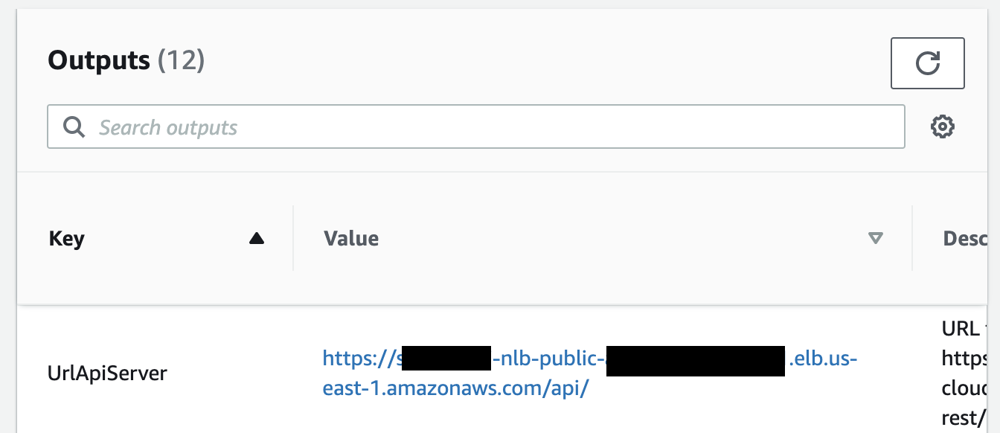
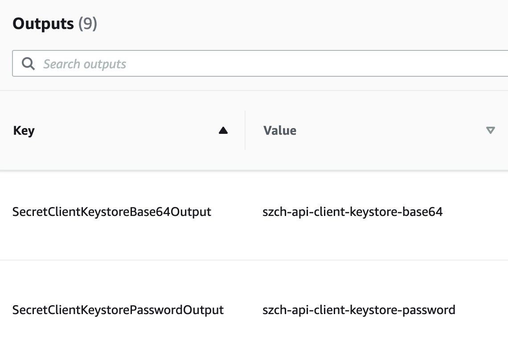

# aws-cloudformation-dev-rest

## Synopsis

Using the AWS Cloudformation template in this repository,
a developer can bring up an AWS stack to interact with Senzing's API Server
in a secure manner.

## Overview

The following diagram illustrates a Senzing stack brought up by the AWS CloudFormation template.

Using this stack, a developer could interact with Senzing's API Server programmatically.


## Contents

1. [Pre-requisites](#pre-requisites)
1. [Deploy](#deploy)
1. [Interact with Senzing API Server using SSL client authentication](#interact-with-senzing-api-server-using-ssl-client-authentication)
1. [Example applications](#example-applications)
1. [References](#references)

## Pre-requisites

1. Deploy [aws-cloudformation-database-cluster cloudformation stack](https://github.com/Senzing/aws-cloudformation-database-cluster)
1. Install [git](https://github.com/Senzing/knowledge-base/blob/master/HOWTO/install-git.md)
1. Install [aws](https://github.com/Senzing/knowledge-base/blob/main/HOWTO/install-aws-cli.md)

## Deploy

:warning: **Warning:** This Cloudformation deployment will accrue AWS costs.
With appropriate permissions, the
[AWS Cost Explorer](https://aws.amazon.com/aws-cost-management/aws-cost-explorer/)
can help evaluate costs.

1. In [AWS Cloudformation with dev-rest template](https://console.aws.amazon.com/cloudformation/home#/stacks/new?stackName=sz-dev&templateURL=https://s3.amazonaws.com/public-read-access/aws-cloudformation-dev-rest/cloudformation.yaml)
    1. At lower-right, click on "Next" button.
    1. In **Specify stack details**
        1. In **Parameters**
            1. In **Senzing installation**
                1. Accept the End User License Agreement
                1. Adjust the Senzing version, if necessary
                1. If using more than 100k records, input base64 encoded license string
            1. In **Identify existing database stack**
                1. Enter the stack name of the previously deployed
                   [aws-cloudformation-database-cluster](https://github.com/Senzing/aws-cloudformation-database-cluster)
                   Cloudformation stack
                   Example:  `senzing-db`
            1. In **Security**
                1. Enter the permitted IP address block
            1. In **Security responsibility**
                1. Understand the nature of the security in the deployment.
                1. Once understood, enter "I AGREE".
        1. At lower-right, click "Next" button.
    1. In **Configure stack options**
        1. At lower-right, click "Next" button.
    1. In **Review [name-of-stack]**
        1. Near the bottom, in **Capabilities**
            1. Check ":ballot_box_with_check: I acknowledge that AWS CloudFormation might create IAM resources."
        1. At lower-right, click "Create stack" button.

## Interact with Senzing API Server using SSL client authentication

1. :pencil2: From the Cloudformation Stack details "Outputs" tab, "Value" column,
   identify the Senzing API Server URL from the "Value".
   Example:

    ```console
    export SENZING_API_SERVER_URL=https://XXXXXXXX.amazonaws.com/api
    ```

   This is where to find the information in the AWS Cloudformation management console:

   

1. :pencil2: From the Cloudformation Stack details "Outputs" tab, "Value" column,
   identify the client keystore and password secret name.
   Example:

    ```console
    export SECRET_CLIENT_KEYSTORE_BASE64=xxxxxxxx-client-keystore-base64
    export SECRET_CLIENT_KEYSTORE_PASSWORD=xxxxxxxx-client-keystore-password
    ```

   This is where to find the information in the AWS Cloudformation management console:

   

1. :pencil2: Define a location for the P12 file.
   Example:

    ```console
    export CLIENT_STORE_P12_FILE=~/my-client-store.p12
    ```

1. Poplulate the `CLIENT_STORE_P12_FILE` by retrieving the client keystore from the secret manager.
   The AWS `secretsmanager:GetSecretValue` permission is required.
   Example:

    ```console
    aws secretsmanager get-secret-value \
        --secret-id ${SECRET_CLIENT_KEYSTORE_BASE64} \
    | jq --raw-output .SecretString \
    | base64 --decode \
    > ${CLIENT_STORE_P12_FILE}
    ```

1. Retrieve the client keystore password value.
   The AWS `secretsmanager:GetSecretValue` permission is required.
   Example:

    ```console
    export SECRET_CLIENT_KEYSTORE_PASSWORD_VALUE=$( \
        aws secretsmanager get-secret-value \
            --secret-id ${SECRET_CLIENT_KEYSTORE_PASSWORD} \
        | jq --raw-output .SecretString \
        )
    ```

1. To interact directly with the Senzing API server,
   use the `--cert` and `--cert-type` options of
   `curl` to authenticate to the API server.
   Example:

    ```console
    curl \
        --insecure \
        ${SENZING_API_SERVER_URL}/heartbeat \
        --cert ${CLIENT_STORE_P12_FILE}:${SECRET_CLIENT_KEYSTORE_PASSWORD_VALUE} \
        --cert-type P12
    ```

## Example applications

Two example applications were created to illustrate how an application can authenticate with the Senzing's API Server.

1. [cli_demo.py](examples/cli_demo.py) - The command line interface (CLI) application.
1. [webapp_demo.py](examples/webapp_demo.py) - The web application.

### Example applications prerequisites

1. Clone repository.
   First, set these environment variable values:

    ```console
    export GIT_ACCOUNT=senzing
    export GIT_REPOSITORY=aws-cloudformation-dev-rest
    export GIT_ACCOUNT_DIR=~/${GIT_ACCOUNT}.git
    export GIT_REPOSITORY_DIR="${GIT_ACCOUNT_DIR}/${GIT_REPOSITORY}"
    ```

   then using the environment variables values just set,
   follow steps in [clone-repository](https://github.com/Senzing/knowledge-base/blob/master/HOWTO/clone-repository.md)
   to install the Git repository.

1. Set the following environment variable as seen above:
    1. `SENZING_API_SERVER_URL`
    1. `CLIENT_STORE_P12_FILE`
    1. `SECRET_CLIENT_KEYSTORE_PASSWORD_VALUE`

1. Install prerequisites.
   Example:

    ```console
    cd ${GIT_REPOSITORY_DIR}/examples
    pip install -r requirements.txt
    ```

### CLI application

1. Use the following command to run the example CLI application.

    ```console
    ${GIT_REPOSITORY_DIR}/examples/cli_demo.py
    ```

### Web application

1. Run the example web application.
   **Note:** Homebrew users may see deprecation warnings like
   "DEPRECATION: Configuring installation scheme with distutils ...".
   Do not worry and continue on.
   To understand the warnings, refer to [this](https://github.com/Homebrew/homebrew-core/issues/76621).
   Example:

    ```console
    ${GIT_REPOSITORY_DIR}/examples/webapp_demo.py
    ```

1. In a separate terminal, run the following `curl` commands
   to get the example web application to interact the Senzing's api server,
   Example:

    ```console
    curl http://127.0.0.1:5000

    curl http://127.0.0.1:5000/test-query
    ```

   Or in a browser visit:

   - [http://127.0.0.1:5000](http://127.0.0.1:5000)
   - [http://127.0.0.1:5000/test-query](http://127.0.0.1:5000/test-query)

1. For more Senzing HTTP REST APIs, please refer to the
   [swagger documentation](https://petstore.swagger.io/?url=https://raw.githubusercontent.com/Senzing/senzing-rest-api-specification/master/senzing-rest-api.yaml).

## References

To understand mutual TLS authentication better, refer to the resources here:

- [What is Mutual TLS Authentication?](https://www.cloudflare.com/learning/access-management/what-is-mutual-tls/)
- [Difference between key store and trust store](https://www.baeldung.com/java-keystore-truststore-difference)
