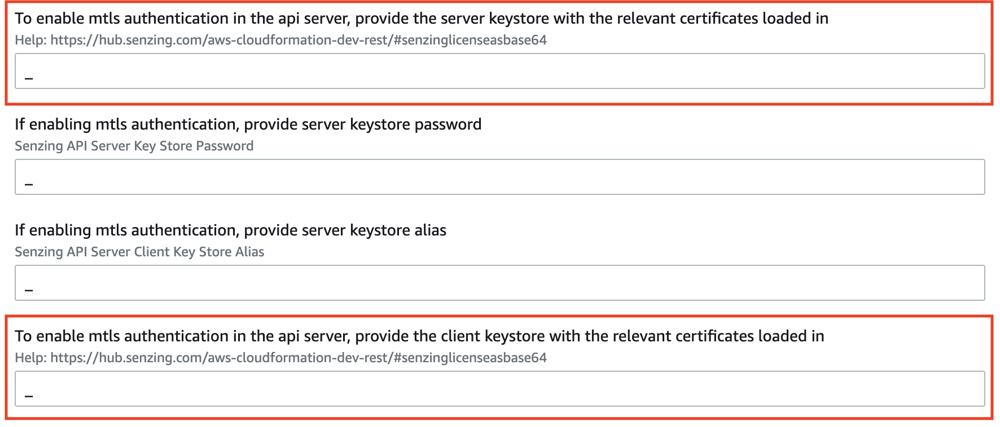

# aws-cloudformation-dev-rest
AWS Cloudformation for developers using Senzing HTTP REST API

## System Admin Guide: How to setup SSL client authentication?

1. Install [adoptopenjdk 11](https://adoptopenjdk.net/archive.html)

2. Generate a key store, certificate and trust store using [step 1 & 2 in this guide](https://github.com/Senzing/senzing-api-server#ssl-client-authentication)

3. Convert key store and trust store into base64

```
base64 <path to key store>
base64 <path to trust store>
```
4. Put base64 output into cloudformation stack



## Developers Guide: How to authenticate using SSL client authentication?

As a developer you can make a curl call by going through [step 4 & 5 in this guide](https://github.com/Senzing/senzing-api-server#ssl-client-authentication)

To get a more in-depth look on how an application can authenticate with the senzing's api server, refer to [here](examples/demo.py)

## References

To understand mutual TLS authentication better, refer to the resources here
- [What is Mutual TLS Authentication?](https://www.cloudflare.com/learning/access-management/what-is-mutual-tls/)
- [Difference between key store and trust store](https://www.baeldung.com/java-keystore-truststore-difference)