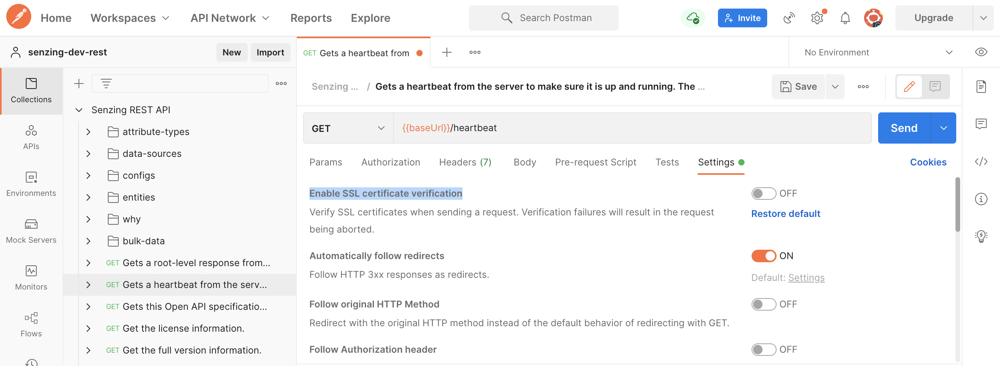
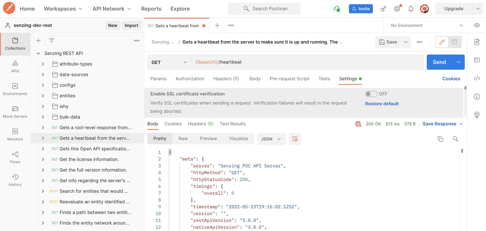

# Interact with Senzing API Server using Postman

1. Import Senzing's REST API specification into postman by clicking on the "import" tab and inserting https://raw.githubusercontent.com/Senzing/senzing-rest-api-specification/main/senzing-rest-api.yaml into the url field.

    

1. Edit the Senzing REST API collection and update the baseUrl variable with the UrlApiServer output found in the dev-rest cloudformation stack.

    

1. Import the client certificate by clicking on "Settings" and followed by "Certificates". Enter the UrlApiServer domain into the "Host" field, upload the client keystore under PFX file and enter in the keystore password.

    

1. Go back to the Senzing REST API collection, click on the request that starts with "Gets a heartbeat", click on the settings and turn off "Enable SSL certificate verification"

    

1. Click on send and get a heartbeat response from the Senzing API Server

    

