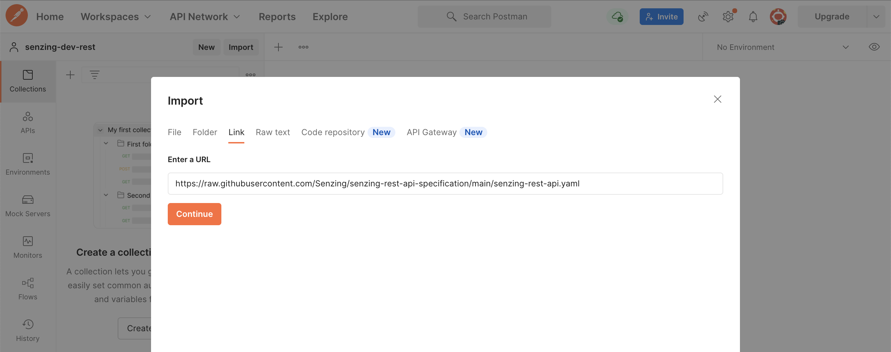
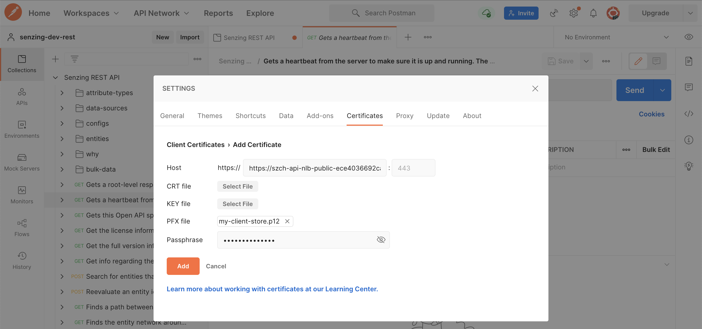

# Interact with Senzing API Server using Postman

1. Create a workspace.
    1. Postman > Workspaces > Create Workspace
    1. In "Create Workspace":
        1. **Name:** Senzing API
1. In "Senzing API" workspace, import Senzing's REST API specification into postman.
    1. Click the "Import" button.
    1. Select the "Link" tab.
    1. In "Enter a URL", enter `https://raw.githubusercontent.com/Senzing/senzing-rest-api-specification/main/senzing-rest-api.yaml`.
    1. Click "Continue" button

        

1. In "Import" dialog:
    1. Click "Import" button.
    1. In "Import complete", click "Close" button.
1. In left-hand navigation bar, select "Collections".
    1. Select "Senzing REST API"
    1. Select "Variables" tab.
    1. For the variable "baseUrl", modify the "CURRENT VALUE"
       to be the value of the **UrlApiServer** seen in the
       "Outputs" tab of the AWS Senzing Dev-Rest Cloudformation.

    

1. Import the client certificate by clicking on "Settings" and followed by "Certificates". Enter the UrlApiServer domain into the "Host" field, upload the client keystore under PFX file and enter in the keystore password.

    

1. Go back to the Senzing REST API collection, click on the request that starts with "Gets a heartbeat", click on the settings and turn off "Enable SSL certificate verification"

    

1. Click on send and get a heartbeat response from the Senzing API Server

    

